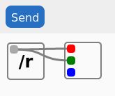

# minored

Proof-of-concept of browser based flow editor backed by micropython.



## Use

- This demo assumes you have a connected to ESP32 devkit flashed with micropython 1.15+ in advance
- Install python dependencies: `pip install pipenv && pipenv sync`
- Install JS dependencies `pushd frontend && yarn && popd`
- Rename `src/config_example.py` to `src/config.py` and update credentials.
- Build assets and copy all the files to y your board with `BOARD=u1 ./deploy.sh`, where `u1` stands for `/dev/ttyUSB1`

## Development

This project uses [micropy-cli](https://github.com/BradenM/micropy-cli) stubs for proper lint of micropython standard library. To install run:

```
micropy stubs add esp32-micropython-1.15.0
```
